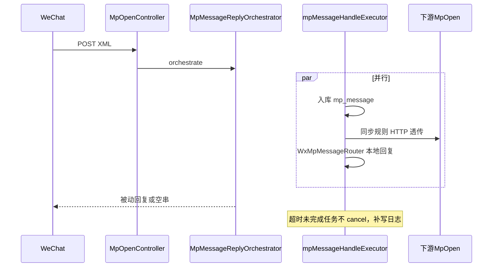

# WeChat Messages Server — 后端 API

<!-- README-I18N:START -->

**[English](./README.en.md)** | **简体中文**（当前）

<!-- README-I18N:END -->

基于 [ruoyi-vue-pro](https://gitee.com/zhijiantianya/ruoyi-vue-pro) 二次开发的 **微信公众号消息服务**（Spring Boot）。本仓库为 **后端 API**；管理端 UI 见 [wechat-messages-server-vben](https://github.com/fan-stars/wechat-messages-server-vben)。

核心扩展在 **`fan-module-mp`**：在原有公众号能力之上，提供 **消息 HTTP 透传转发**（同步/异步、优先级、转发日志、多线程编排被动回复）。

## 仓库地址

| | 后端 API（本仓库） | 管理端 UI |
| --- | --- | --- |
| **Gitee** | [fan-stars/wechat-messages-server](https://gitee.com/fan-stars/wechat-messages-server) | [fan-stars/wechat-messages-server-vben](https://gitee.com/fan-stars/wechat-messages-server-vben) |
| **GitHub** | [fan-stars/wechat-messages-server](https://github.com/fan-stars/wechat-messages-server) | [fan-stars/wechat-messages-server-vben](https://github.com/fan-stars/wechat-messages-server-vben) |

## 致谢

本项目后端衍生自 **[ruoyi-vue-pro](https://gitee.com/zhijiantianya/ruoyi-vue-pro)**（芋道源码）。微信能力基于 WxJava；消息转发编排为在本项目 `fan-module-mp` 中的扩展实现。

## 技术栈

- Java 17+、Spring Boot 3
- MySQL、Redis（与 ruoyi-vue-pro 一致）
- WxJava（公众号 SDK）
- Retrofit + OkHttp（转发 HTTP 透传）

## MP 模块能力

### 已有能力

`fan-module-mp` 提供公众号 **账号、菜单、粉丝、标签、消息、自动回复、素材、统计** 等管理能力（详见模块 `pom.xml` 说明）。

### 消息 HTTP 转发（本仓库重点）

将粉丝发给公众号的入站消息，按规则 **原样 POST** 到下游系统（Query + XML 与微信回调一致），由下游处理后再决定是否回复微信。



| 能力 | 说明 |
| --- | --- |
| 同步 / 异步转发 | 异步可开启 `receive_response` 落库响应体，**不可**作为微信被动回复 |
| 优先级 | 按 `priority DESC, id ASC` 执行；仅第一条「同步 + 响应作回复」且成功的规则采纳为被动回复 |
| HTTP 透传 | 原样转发 Query 与 XML Body；`target_url` 为完整公众号回调地址 |
| AES 被动回复 | 下游返回已加密 XML 时 MP **原样透传**，Controller 不再二次 `encrypt` |
| 转发日志 | `mp_message_forward_log`，支持成功/失败/超时/跳过；管理端可查询、导出 |

完整设计（表结构、HTTP 契约、降级策略、实现索引）见：

**[fan-module-mp/docs/mp-message-forward-design.md](./fan-module-mp/docs/mp-message-forward-design.md)**

## 关键代码与配置

| 项 | 路径 / 配置 |
| --- | --- |
| 微信回调入口 | `fan-module-mp/.../controller/admin/open/MpOpenController.java` |
| 消息编排 | `fan-module-mp/.../service/message/MpMessageReplyOrchestrator.java` |
| 转发执行 | `fan-module-mp/.../service/forward/MessageForwardExecuteServiceImpl.java` |
| HTTP 客户端 | `fan-module-mp/.../framework/retrofit2/.../MpMessageForwardClientImpl.java` |
| 编排线程池 | `fan-module-mp/.../framework/mp/config/MpMessageHandleExecutorConfiguration.java` |
| 被动回复等待上限 | `fan.mp.message-reply-wait-timeout-ms`（`fan-server/src/main/resources/application.yaml`，默认 10000 ms，可按环境调整） |
| MP SQL 初始化 | `sql/mysql/fan-module-mp.sql`（含转发规则/日志表、字典、菜单 3052–3063） |

## 快速开始

### 环境要求

- JDK 17+
- MySQL 8+
- Redis（与 ruoyi-vue-pro 部署方式一致）

### 数据库

在 `sql/mysql/` 下按顺序导入本项目脚本（**无需** `ruoyi-vue-pro.sql`）：

1. `fan-module-system.sql` — 系统模块（用户、权限、菜单等）
2. `fan-module-infra.sql` — 基础设施模块
3. `fan-module-mp.sql` — 公众号模块（含转发规则/日志表、字典、菜单 3052–3063）

若使用定时任务，可另导入 `quartz.sql`。

### 公众号配置

在 `fan-server/src/main/resources/application-local.yaml`（或对应环境配置）中配置 `wx.mp`（appId、secret、token、aesKey 等），参见 WxJava / ruoyi 文档。

### 启动

```bash
# 在仓库根目录
mvn -pl fan-server -am package -DskipTests
# 运行 fan-server 主类，或使用 IDE 启动 fan-server 模块
```

默认端口：**48080**（`application-local.yaml`）。

### 微信回调 URL

公众号后台配置服务器地址，路径形如：

```text
https://你的域名/admin-api/mp/open/{appId}
```

- **GET**：签名校验（由 MP 处理，不转发）。
- **POST**：验签、解密后进入 `MpMessageReplyOrchestrator` 编排。

## 下游对接要点

摘自设计文档 §6，完整说明见 [mp-message-forward-design.md](./fan-module-mp/docs/mp-message-forward-design.md)。

| 项 | 说明 |
| --- | --- |
| `target_url` | 下游完整回调地址，例如 `http://业务服务:48080/admin-api/mp/open/wxXXXXXXXX` |
| 请求 | `POST`，Query 与微信一致；`Content-Type: application/xml`；Body 为原始 XML |
| 追踪头 | `X-Mp-Rule-Id`、`X-Mp-Message-Id`（可选，标准 Handler 可忽略） |
| 响应 | `receive_response=1` 时读取 body；`use_response_as_reply=1` 且同步成功时作为被动回复 |
| 验签 | 下游须配置与 MP **相同的 token / aesKey** 方可验签、解密 |

## 管理端

转发规则、转发日志的 CRUD 与查询在独立前端仓库：

- [wechat-messages-server-vben](https://github.com/fan-stars/wechat-messages-server-vben)
- 菜单组件：`mp/forward/rule`、`mp/forward/log`

## License

遵循本仓库及上游 ruoyi-vue-pro、WxJava 等相关开源协议。
