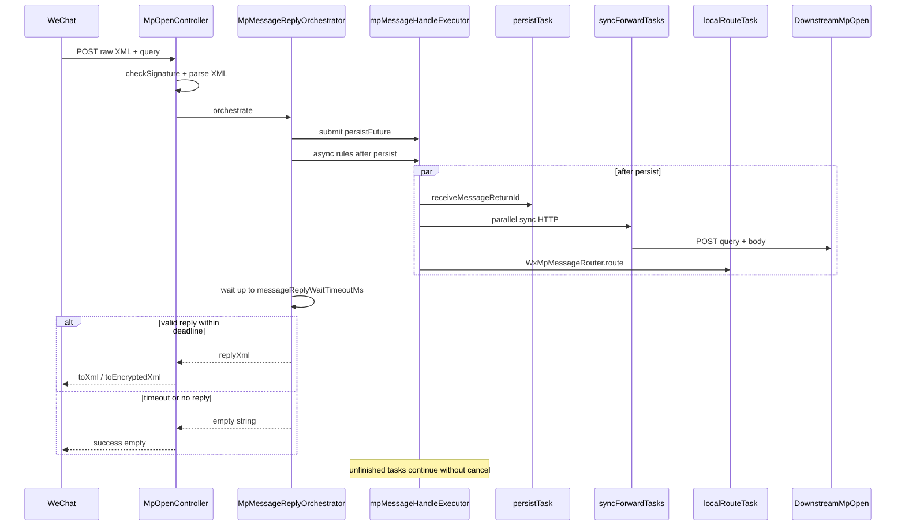
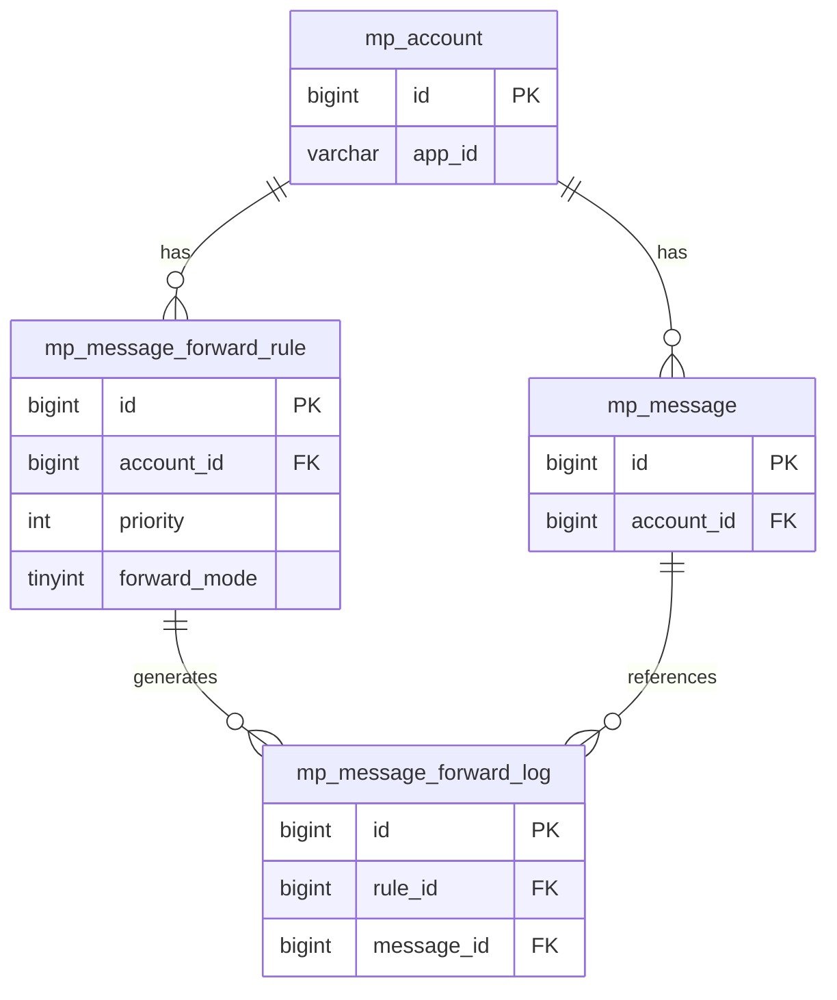
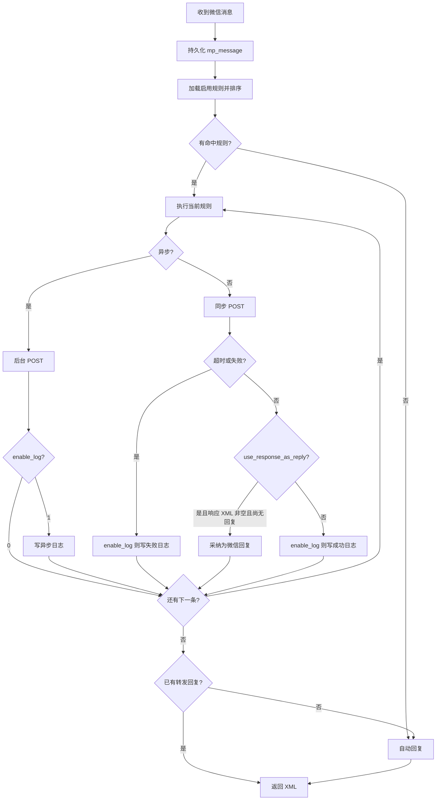

# 公众号消息转发 — 设计文档

## 1. 背景与范围

### 1.1 背景

当前 `fan-module-mp` 模块已支持微信公众号消息接收、持久化（`mp_message`）、自动回复、菜单回复、客服消息等能力。业务上需要将**粉丝发送给公众号的消息**转发到外部系统（其他项目），由外部系统处理后再决定是否回复微信粉丝。

### 1.2 目标

- 支持按公众号配置多条 **HTTP 透传** 转发规则（原样转发微信 Query + XML，下游零改造）。
- 支持 **同步 / 异步** 两种转发模式。
- 支持配置是否 **接收 HTTP 响应**，以及是否将响应 **作为微信被动回复**。
- 支持 **优先级**：按优先级从高到低依次执行所有命中规则。
- 全局仅 **第一条**「同步 + 接收响应 + 作为微信回复」且成功的规则可产生被动回复。
- 记录每次转发的 **执行日志**，便于排查。

### 1.3 范围

| 范围内 | 范围外 |
|--------|--------|
| 入站消息（微信回调）转发 | 出站客服消息、模板消息转发 |
| HTTP Webhook 接入 | 消息队列（MQ）接入 |
| 规则管理、日志查询（管理端） | 前端页面实现（后续迭代） |
| MySQL 表结构与后端实现指引 | 具体业务系统对接细节 |

### 1.4 约束

- 微信被动回复必须在约 **5 秒** 内完成；同步转发总耗时应控制在 **4 秒以内**（建议值）。
- 转发前消息须已写入 `mp_message`，保证 `messageId` 可用。
- 依赖 `system` 模块的 `system_dict_*`、`system_menu` 表（见 `fan-module-mp.sql` 初始化数据）。

---

## 2. 名词与枚举

### 2.1 转发模式 `forward_mode`

| 值 | 名称 | 说明 |
|----|------|------|
| 1 | 同步 | 在微信回调线程内发起 HTTP 请求，受 `timeout_ms` 限制 |
| 2 | 异步 | 投递后台任务后立即返回，不阻塞微信回调，**不接收**响应用于回复微信 |

字典类型：`mp_message_forward_mode`（字典数据 ID：3013、3014）

### 2.2 转发日志状态 `status`（`mp_message_forward_log`）

| 值 | 名称 | 说明 |
|----|------|------|
| 0 | 成功 | HTTP 调用完成且无异常（是否业务成功由 `http_status` 判断） |
| 1 | 失败 | HTTP 错误、网络异常、响应解析失败等 |
| 2 | 超时 | 同步调用超过 `timeout_ms` |
| 3 | 跳过 | 规则未命中、已产生微信回复后跳过后续「作为回复」规则等 |

字典类型：`mp_message_forward_log_status`（字典数据 ID：3015–3018）

### 2.3 规则状态 `status`

与系统通用字典 `common_status` 一致：**0 = 启用，1 = 停用**。

### 2.4 优先级 `priority`

**数值越大，优先级越高。** 同一公众号下多条规则按 `priority DESC, id ASC` 排序后依次执行。

### 2.5 规则组合语义

| forward_mode | receive_response | use_response_as_reply | 行为 |
|:------------:|:----------------:|:---------------------:|------|
| 异步(2) | 0 | 0 | 后台 POST，不读响应体 |
| 异步(2) | 1 | 0 | 后台 POST，读取响应体写入日志，**不参与**微信被动回复 |
| 同步(1) | 0 | 0 | 同步 POST，忽略响应体，继续下一条 |
| 同步(1) | 1 | 0 | 同步 POST，记录响应，**不**回复微信 |
| 同步(1) | 1 | 1 | 同步 POST，将响应 XML 原样作为被动回复；**仅全局第一条成功规则生效** |

**应用层校验：**

- `forward_mode = 2` 时，`use_response_as_reply` 必须为 `false`（`receive_response` 可为 `true`）。
- `use_response_as_reply = 1` 时，必须 `receive_response = 1` 且 `forward_mode = 1`。

### 2.6 是否记录日志 `enable_log`

| 值 | 说明 |
|----|------|
| 1（默认） | 每次转发写入 `mp_message_forward_log` |
| 0 | 不写入日志表；HTTP 透传与微信被动回复逻辑不变 |

关闭时适用于高频、低排查需求的规则，减轻数据库压力；失败/超时可在应用 SLF4J 日志中保留简要记录（实现阶段约定）。

---

## 3. 业务流程

### 3.1 总体时序



### 3.2 规则匹配

1. 查询 `account_id` 下 `status = 0`（启用）且未删除的规则。
2. 若 `message_types` 非空，则当前消息的 `type`（或事件 `event`）须包含在列表中（逗号分隔）；为空表示不过滤。
3. 按 `priority DESC, id ASC` 排序。

### 3.3 执行策略（多线程编排）

- **编排入口**：`MpMessageReplyOrchestrator`，线程池 `mpMessageHandleExecutor`（TTL 上下文传递）。
- **回复等待**：默认 `fan.mp.message-reply-wait-timeout-ms = 4000`，超时向微信返回空串（成功无回复）；**不 cancel** 未完成任务，后台继续执行并补写日志。
- **入库**：`persistFuture` 根任务，完成后设置 `MpContextHolder.messagePersisted` / `messageId`。
- **异步规则**：`persistFuture` 后 fire-and-forget（`@Async` 或线程池），不参与被动回复等待。
- **同步规则**：`persistFuture` 后 **并行** HTTP；按 `priority DESC, id ASC` 选取第一条「`use_response_as_reply` + 成功 + 非空 XML」作为候选回复；单规则 `timeout_ms` 与全局剩余时间取 `min`。
- **本地处理**：`persistFuture` 后并行执行 `WxMpMessageRouter.route`；转发无回复时在等待窗口内采纳本地 XML。
- **日志落库**：`enable_log = 1` 时写入；同步规则在窗口内按优先级写 `SKIPPED`；超时后完成的规则由 `whenComplete` 补写。

### 3.4 与自动回复的关系

- `MpOpenController` 验签、解析后委托 `MpMessageReplyOrchestrator` 统一编排。
- **转发回复优先于本地 Router**；转发无有效回复时在等待窗口内采纳 Router 结果。
- 若窗口内均无回复，返回空串；Router / 转发任务可在后台继续完成。

---

## 4. 与现有组件关系

| 组件 | 路径 | 关系 |
|------|------|------|
| 微信入口 | `MpOpenController` | 验签 → 解析 → `MpMessageReplyOrchestrator` → 返回 XML 或空串 |
| 消息编排 | `MpMessageReplyOrchestrator` | 入库 + 并行同步转发 + 并行 Router，最多等待配置时长 |
| 消息持久化 | `MpMessageServiceImpl.receiveMessage` | 编排线程池内入库；`MessageReceiveHandler` 检测已入库则跳过 |
| 转发执行 | `MessageForwardExecuteServiceImpl` | 原样 POST query + XML 到 `target_url` |
| 消息路由 | `DefaultMpServiceFactory.buildMpMessageRouter` | 无转发回复时的兜底链路 |
| 自动回复 | `MessageAutoReplyHandler` | 转发无回复时的兜底 |
| SQL 初始化 | `sql/mysql/fan-module-mp.sql` | 表结构 + 字典 + 菜单 |

### 4.1 入库去重

`MpOpenController` 在转发前同步调用 `receiveMessage`，并通过 `MpContextHolder.setMessagePersisted(true)` 标记。`MessageReceiveHandler` 检测到已入库则不再重复插入。

### 4.2 下游兼容

下游 `target_url` 填写完整公众号回调地址（与公众号后台配置格式一致），例如：

`http://业务服务/admin-api/mp/open/wxXXXXXXXX`

下游须配置与 MP **相同的 token / aesKey**，方可验签和解密（与直连微信行为一致）。

---

## 5. 表结构说明

### 5.1 ER 关系



### 5.2 `mp_message_forward_rule` — 转发规则

| 字段 | 类型 | 说明 |
|------|------|------|
| id | bigint | 主键 |
| account_id | bigint | 公众号账号 ID |
| name | varchar(100) | 规则名称 |
| status | tinyint | 0 启用 / 1 停用 |
| priority | int | 优先级，越大越高 |
| forward_mode | tinyint | 1 同步 / 2 异步 |
| receive_response | bit(1) | 是否读取 HTTP 响应 |
| use_response_as_reply | bit(1) | 是否作为微信被动回复 |
| target_url | varchar(1024) | 下游完整公众号回调 URL |
| timeout_ms | int | 同步超时，默认 3000 |
| message_types | varchar(512) | 逗号分隔消息类型，空=全部 |
| enable_log | bit(1) | 是否记录转发日志，默认 1 |
| remark | varchar(255) | 备注 |
| + BaseDO | | creator, create_time, updater, update_time, deleted |

索引：`idx_account_status_priority (account_id, status, priority)`

### 5.3 `mp_message_forward_log` — 转发日志

| 字段 | 类型 | 说明 |
|------|------|------|
| id | bigint | 主键 |
| rule_id | bigint | 规则 ID |
| message_id | bigint | `mp_message.id` |
| account_id | bigint | 冗余 |
| app_id | varchar(100) | 冗余 |
| openid | varchar(100) | 粉丝 openid |
| forward_mode / receive_response / use_response_as_reply | | 执行快照 |
| target_url | varchar(1024) | URL 快照 |
| request_body | text | 请求体 XML（原文） |
| response_body | text | 响应体 XML（原文） |
| http_status | int | HTTP 状态码 |
| status | tinyint | 0 成功 1 失败 2 超时 3 跳过 |
| duration_ms | int | 耗时毫秒 |
| error_msg | varchar(1024) | 错误摘要 |
| + BaseDO | | |

索引：`idx_message_id`、`idx_rule_id_create_time`

---

## 6. 微信 HTTP 透传契约

### 6.1 `target_url`

填写下游**完整公众号回调地址**，与公众号后台配置格式一致：

```text
http://业务服务:48080/admin-api/mp/open/wxXXXXXXXX
```

MP 不向 URL 追加 path，规则里写什么地址就 POST 到哪里。

### 6.2 出站请求（MP → 下游）

| 项 | 值 |
|----|-----|
| Method | `POST` |
| Query | 与微信请求相同：`signature`、`timestamp`、`nonce`、`openid`、`encrypt_type`（有则带）、`msg_signature`（加密模式） |
| Header | `Content-Type: application/xml; charset=UTF-8` |
| Body | 与微信推送**相同**的原始 XML 字符串 |

**可选追踪头**（标准微信 Handler 会忽略）：

| Header | 说明 |
|--------|------|
| X-Mp-Rule-Id | 规则 ID |
| X-Mp-Message-Id | `mp_message.id` |

### 6.3 入站响应（下游 → MP）

当 `receive_response = 1` 时读取响应体（同步与异步均适用）：

| 规则 | MP 行为 |
|------|---------|
| 同步 + `use_response_as_reply = 1` 且响应体非空 | **原样返回给微信**（编排器采纳） |
| 同步 + `use_response_as_reply = 0` | 记录日志，**不**作为被动回复 |
| 异步（任意 `use_response_as_reply`） | 记录日志，**不**参与被动回复等待 |
| `receive_response = 0` | 不读响应体 |
| 响应为空 / HTTP 非 2xx / 超时 | 同步视为无回复继续下一条；异步仅记失败/超时日志 |

加密模式下，下游须返回与「直连微信」相同格式（明文或 AES 加密 XML）；MP **不再二次加解密**响应。

### 6.4 GET 校验

微信 **GET 签名校验** 仍由 MP `checkSignature` 处理，**不转发 GET**。下游只需处理 POST。

### 6.5 MP 侧验签

MP 转发前仍执行 `checkSignature`。下游若配置相同 `token`，可用同一组 query 参数再次验签。

---

## 7. 降级策略



| 场景 | 处理 |
|------|------|
| 无启用规则 | 走自动回复 |
| `enable_log = 0` | 执行转发，不写 `mp_message_forward_log` |
| 同步超时 | `enable_log = 1` 时记失败日志，执行下一条规则 |
| HTTP 非 2xx | `enable_log = 1` 时记失败日志，执行下一条规则 |
| 响应体为空 | 不回复微信，执行下一条规则 |
| 第二条「作为回复」规则成功 | `enable_log = 1` 时记日志（跳过回复），不覆盖第一条回复 |
| 全部转发均无回复 | 降级到 `MessageAutoReplyHandler` |
| 异步规则异常 | `enable_log = 1` 时记日志；不影响微信回调响应 |

---

## 8. 管理端功能清单

### 8.1 菜单与权限（已写入 SQL）

挂在「公众号管理」(3001) 下，与 [`sql.sql`](../../sql/sql.sql) 及前端 `mp/forward/rule/index` 对齐：

| 菜单 ID | 名称 | 权限标识 |
|---------|------|----------|
| 3052 | 转发规则管理（`message-forward-rule`） | — |
| 3053 | 转发规则查询 | `mp:message-forward-rule:query` |
| 3054 | 转发规则创建 | `mp:message-forward-rule:create` |
| 3055 | 转发规则更新 | `mp:message-forward-rule:update` |
| 3056 | 转发规则删除 | `mp:message-forward-rule:delete` |
| 3057 | 转发规则导出 | `mp:message-forward-rule:export` |
| 3058 | 转发日志管理（`message-forward-log`，sort=30） | — |
| 3059 | 转发日志查询 | `mp:message-forward-log:query` |
| 3060 | 转发日志创建 | `mp:message-forward-log:create` |
| 3061 | 转发日志更新 | `mp:message-forward-log:update` |
| 3062 | 转发日志删除 | `mp:message-forward-log:delete` |
| 3063 | 转发日志导出 | `mp:message-forward-log:export` |

路由：`/mp/message-forward-rule` → `MessageForwardRule`；`/mp/message-forward-log` → `MessageForwardLog`（`mp/forward/log/index`）。

### 8.2 功能点（后续实现）

1. **转发规则 CRUD**：按公众号配置 URL、模式、优先级、消息类型过滤、是否记录日志（默认开启）等。
2. **转发日志分页查询**：按消息、规则、状态、时间筛选（菜单 3058–3063，`mp/forward/log/index`）。
3. **规则校验**：保存时校验组合语义（异步不可接收响应等）。
4. **连通性测试（可选）**：发送模拟 XML + query 探测目标 URL。

---

## 9. 后续实现任务拆分

| 序号 | 模块 | 任务 |
|------|------|------|
| 1 | dal | `MpMessageForwardRuleDO`、`MpMessageForwardLogDO`、Mapper |
| 2 | enums | `MpMessageForwardModeEnum`、`MpMessageForwardLogStatusEnum` |
| 3 | service | `MpMessageForwardRuleService`（CRUD）、`MpMessageForwardExecuteService`（执行转发） |
| 4 | client | HTTP 客户端封装（XML 透传、超时、日志落库） |
| 5 | controller | `MpOpenController` 集成转发 + 入库去重 |
| 6 | admin | 管理端 API + VO |
| 7 | 前端 | `mp/forward/rule/index`、`mp/forward/log/index`（已实现） |
| 8 | 字典 | 前端使用 `mp_message_forward_mode`、`mp_message_forward_log_status` |

---

## 10. 风险与注意事项

1. **5 秒限制**：多条同步规则会累加延迟，管理端应提示「同步规则总超时建议小于 4 秒」。
2. **异步入库**：须确保转发前 `messageId` 已生成（见 4.2）。
3. **幂等**：微信可能重试推送，下游按微信 `MsgId` 去重（与直连一致）；`X-Mp-Message-Id` 仅作 MP 侧辅助。
4. **安全**：`target_url` 建议内网或 HTTPS；下游与 MP 使用相同 token/aesKey。
5. **事件消息**：关注/取消关注等是否转发由 `message_types` 配置，默认建议仅转发用户消息类型。
6. **5 秒限制**：多条同步规则累加延迟，同步规则总超时建议小于 4 秒。

---

## 附录：SQL 脚本位置

- 建表与初始化数据：[`sql/mysql/fan-module-mp.sql`](../../sql/mysql/fan-module-mp.sql)
- 执行顺序：先 `fan-module-system.sql`，再 `fan-module-mp.sql`
